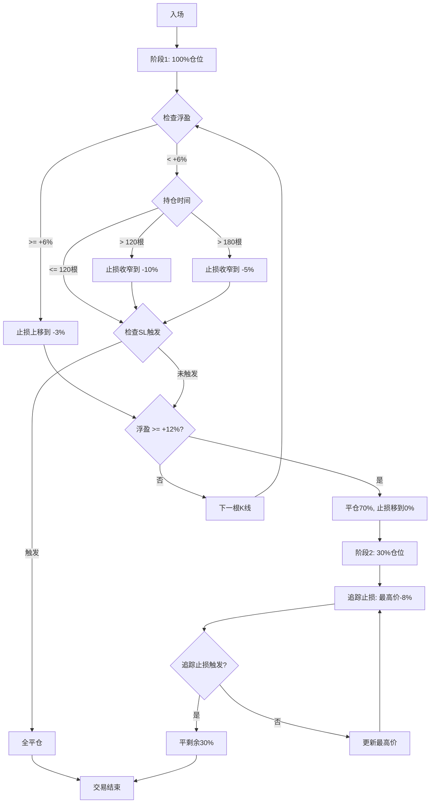

# 追踪止盈止损系统实现计划

## 一、新增配置参数

在 [config.py](config.py) 的 `PAPER_TRADING_CONFIG` 中添加：

```python
# 追踪止盈止损系统
"TRAILING_STOP_ENABLED": True,           # 启用追踪止损
"TRAILING_STOP_PCT": 0.08,               # 追踪止损间距 8%（价格）

# 阶梯止损上移
"BREAKEVEN_THRESHOLD_PCT": 6.0,          # 第一档阈值：浮盈+6%（杠杆后）
"BREAKEVEN_SL_PCT": -3.0,                # 第一档止损：-3%（杠杆后）

# 时间衰减止损
"TIME_DECAY_ENABLED": True,              # 启用时间衰减
"TIME_DECAY_BAR_1": 120,                 # 第一档：120根K线
"TIME_DECAY_SL_1": -10.0,                # 第一档止损：-10%（杠杆后）
"TIME_DECAY_BAR_2": 180,                 # 第二档：180根K线
"TIME_DECAY_SL_2": -5.0,                 # 第二档止损：-5%（杠杆后）
```

---

## 二、回测器修改

### 2.1 Position 数据结构 ([core/backtester.py](core/backtester.py) 24-37行)

新增字段：

```python
peak_pnl_pct: float = 0.0           # 追踪最高浮盈（杠杆后%）
ever_reached_6pct: bool = False     # 是否曾到达+6%（时间衰减判断用）
original_stop_loss: float = 0.0     # 原始止损价格（用于追踪止损计算）
```

### 2.2 _open_position() 修改 (430-473行)

- 移除 `take_profit_2` 的设置（不再需要TP2）
- 保存 `original_stop_loss`

### 2.3 _check_exit() 重写 (544-595行)

新逻辑：

```
阶段1 (stage=1)：入场 → TP1
├─ 计算当前浮盈 pnl_pct
├─ 更新 peak_pnl_pct = max(peak_pnl_pct, pnl_pct)
├─ 止损动态调整：
│   ├─ 若 peak_pnl_pct >= 6% 且未标记 → 止损上移到 -3%，标记 ever_reached_6pct
│   ├─ 若 未到过6% 且 持仓>120根 → 止损收窄到 -10%
│   └─ 若 未到过6% 且 持仓>180根 → 止损收窄到 -5%
├─ 检查SL触发 → 全平
└─ 检查TP1触发 (+12%) → 部分平仓70%，止损移到0%，进入阶段2

阶段2 (stage=2)：TP1后，剩余30%
├─ 追踪止损 = 最高价格 × (1 - 8%)  [LONG]
│            = 最高价格 × (1 + 8%)  [SHORT]
├─ 止损只升不降
├─ 检查追踪止损触发 → 全平剩余
└─ 无TP2上限，让利润奔跑
```

### 2.4 主循环修改 (run_with_strategy 378-422行)

每根K线需要：

1. 计算当前浮盈并更新 `peak_pnl_pct`
2. 将 current_idx 传递给 `_check_exit()` 用于计算持仓时间

---

## 三、模拟交易修改

### 3.1 PaperOrder 数据结构 ([core/paper_trader.py](core/paper_trader.py))

确认已有字段（无需新增）：

- `peak_profit_pct` (218行)
- `original_stop_loss` (待确认)

### 3.2 binance_testnet_trader.py 修改

#### _place_exchange_tp_sl() (1046-1133行)

- 保持不变：开仓时挂 TP1 + SL

#### _place_next_stage_orders() (1370-1459行)

核心修改：

- TP1成交后，**不再挂TP2**
- 只挂保本SL（入场价）
- 后续由 `_update_trailing_stop()` 动态追踪

#### 新增 _update_trailing_stop()

```python
def _update_trailing_stop(self, current_price: float) -> None:
    """动态更新追踪止损（TP1后启用）"""
    # 计算新止损价格 = 最高价 × (1 - 8%)
    # 若新止损 > 当前止损，则更新交易所止损单
```

### 3.3 live_trading_engine.py 修改

#### _process_holding() (3839-3985行)

添加逻辑：

1. 检查浮盈是否达到+6% → 止损上移到-3%
2. 检查时间衰减条件 → 调整止损
3. TP1后启动追踪止损

---

## 四、逻辑流程图




---

## 五、测试验证

1. 回测验证：运行历史数据回测，对比新旧方案的：
  - 胜率
  - 平均盈亏
  - 最大回撤
  - 时间衰减触发次数
2. 模拟交易验证：
  - 检查止损单更新是否正常
  - 检查追踪止损是否正确跟随最高价

